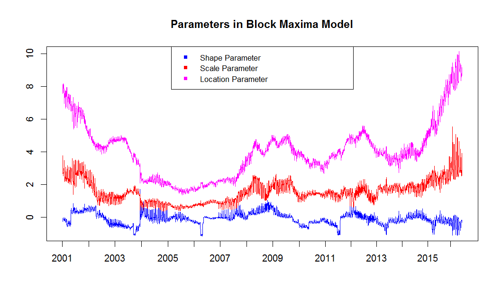

# SFM09var_block_max_params
[](http://quantlet.de/index.php?p=info)

## [](http://quantlet.de/) **SFM09var_block_max_params** [](http://quantlet.de/d3/ia)

```yaml

Name of QuantLet : SFM09var_block_max_params

Published in : Statistics of Financial Markets 

Description : 'Provides and plots shape, scale and location parameters estimated for calculating Value-at-Risk with Block Maxima Model.'

Keywords : VaR, block-maxima, data visualization, estimation, forecast, graphical representation, parameter, plot, portfolio, scale

Author : Chen Yingping ,Deng Ziwen ,Zhang Huijie ,Zhang Yifan.

Submitted : Mon, July 18 2016 by Chen Yingping

Datafiles: BAY_close.txt, BMW_close.txt, SIE_close.txt, alpha_bMax_Portf.txt, beta_bMax_Portf.txt, kappa_bMax_Portf.txt

Example: 'Parameters estimated in Block Maxima Model for portfolio: Bayer, BMW, Siemens.Time period: from 2000-01-18 to 2016-06-28.'

```




```
# R code
```r
# Close all plots and clear variables
graphics.off()
rm(list = ls(all = TRUE))

# Load data
k = t(read.table("kappa_bMax_Portf.txt"))
a = t(read.table("alpha_bMax_Portf.txt"))
b = t(read.table("beta_bMax_Portf.txt"))

# Plots of shape, scale and location parameters
plot(k, type = "l", col = "blue", ylim = c(-1, 10), ylab = c(""), xlab = c(""), axes = FALSE)
lines(a, col = "red")
lines(b, col = "magenta")
title("Parameters in Block Maxima Model")
box()
axis(1, c(250, 510, 771, 1032, 1294, 1554, 1814, 2075, 2337, 2598, 2855, 3112, 3366, 3619, 3871, 
    4099) - 250, c("2001", "2002", "2003", "2004", "2005", "2006", "2007", "2008", "2009", "2010", 
    "2011", "2012", "2013", "2014", "2015", "2016"))
axis(2)
legend("top", c("Shape Parameter", "Scale Parameter", "Location Parameter"), pch = c(15, 15, 
    15), col = c("blue", "red", "magenta"))
